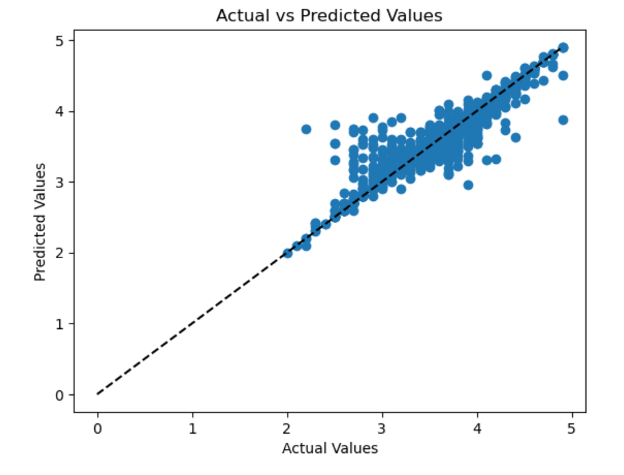

 ***Zomato Bangalore Restaurants***

**Big-Data-Group-14**

This project is a part of the ITCS 6100 - Big Data Analytics for Competitive Advantage course from the University of North Carolina at Charlotte.

 **Deliverable-1**

GitHub - https://github.com/Vishnureddy466/bigData

**1.a	Group Members:**

●	Vishnu Vardhan Reddy Addulamale

●	Anvesh Chidura

●	Jaideep Gurrapu

●	Jagadeshwar Reddy Panta

●	Sushant Sagar Saka

**1.b	Communication plan :**

1.We are connecting weekly twice in google meetings, like discussing in depth over the issues we are facing in the project.

2.Meeting in Atkins Library during the weekends.

3.We are also communicating in slack and sharing the files which are related to the project.

  **2.Data we would consider:**

We would like to select the ”Zomato Bangalore Restaurants" “https://www.kaggle.com/datasets/himanshupoddar/zomato-bangalore-restaurants?datasetId
=153420&sortBy=voteCount”.

  **3.Business Problem or Opportunity for Zomato Bangalore Restaurants:**

The restaurant business is extremely competitive, and restaurants are constantly seeking methods to enhance their offerings and stay ahead of the competition. Understanding the customer preferences, trying to identify popular cuisines and locales, and analyzing pricing and user reviews can all provide useful insights that can assist restaurants in making data-driven decisions.

**Domain Knowledge:**
 
 The following domains can be used to evaluate and translate the information in the Zomato Bangalore     Restaurants dataset:

Restaurant sector: While evaluating the dataset, understanding the restaurant industry and the variables that affect a restaurant's success, such as location, pricing, menu, and customer service, can be very helpful.

Cuisines: Studying Bangalore's various cuisines and their appeal can assist identify popular cuisines and present potential for developing new and distinctive cuisines.

Data analysis and visualization: Understanding of the methods and tools for dealing with and displaying data, including pandas, numpy, matplotlib, and seaborn.

**Research Objectives:**

The objective of this research is to analyze the Zomato Bangalore Restaurants dataset and extract meaningful insights that can help restaurants improve their offerings and stay ahead of their competitors.

Research Questions:
The research will make an effort to respond to the following questions:
How does a restaurant's pricing affect its rankings and reviews from customers?

Do restaurants that deliver food online receive better ratings and more ratings than those that don't?

What are the most common complaints and issues raised in restaurant reviews in Bangalore, and how do these vary by cuisine type and price range?

Are there any notable trends or patterns in the data that suggest opportunities for new restaurant concepts or innovations in the Bangalore market?

Going forward we may add a few more questions and try to resolve those.

**Deliverable-2**

**Data Understanding:**

**a) Exploratory Data Analysis:**

Once the dataset is loaded into an S3 Bucket, by Leveraging the AWS Sagemaker service(https://github.com/Vishnureddy466/bigData/blob/main/Project%20files/AWS%20sagemaker/Deliverable_final.ipynb), we performed Exploratory Data Analysis and performed data preparation tasks on Zomato dataset. The ipynb file of this detailed analysis is located here.

 **b) Dashboard:**

By Leveraging AWS Quicksight service(https://github.com/Vishnureddy466/bigData/blob/main/Project%20files/AWS%20Quicksight/Quicksite_visualization.pdf) we have constructed dashboards on different columns of the dataset and gathered insights that aid to understand the nuances and existing patterns in the dataset. The PDF file consisting of screenshots of these interactive visualizations is present in the file here. 

**Data Preparation:**

Data Preparation involves steps like cleaning and transforming raw data and making it suitable for building Machine Learning models and further analysis. We have performed the necessary data preparation steps as mentioned below:

1. Dropping unnecessary columns in the data.

2. Removing Duplicate Rows.

3. Removing Null values.

4. Transforming "Rate", "estimated_cost_for_2_ppl", "rest_type", "location", and "cuisines" columns.

5.  Encoding textual data using the LabelEncoder function.

**Deliverable 3**

**Analytics, Machine Learning**

We have used Amazon SageMaker and performed Machine learning and analytics for predicting the results. To Analyze the results generated by our model we have used data visualizations like scatterplots. The dataset was trained and evaluated with implementing multiple relevant Machine Learning models like Linear regression, Decision tree regression, Random forest regression, Extra tree regression, Gradient boosting regression, XGB regressor and evaluated the accuracy of the models using the root mean square(RMSE) and R-square methods.

**Evaluation and Optimization**

Machine learning on AWS can speed up performing computations. In this project, we used regression models to forecast the restaurant ratings by using Zomato dataset. We used linear regression, decision tree regression, random forest regression, extra tree regression, gradient boosting regression, and XGB regressor, among other models. Extra Tree regression generated the best accuracy rate which is confirmed by finding R2 score. So all the future datasets can modeled using Extre tree regression model. Using scatter plots we visualized how good is our model by understanding how well the actual values and our model predcited values are correlated. Overall, we discovered that using Extra Tree regression and visualizations helped us predict the ratings of the restaurant.

**Results:**

Is there a linear relationship between the actual and predicted ratings?

How different are the predicted values and the actual values?

What is the relationship between the actual ratings and the predicted ratings for the model?

What is the R-squared value of the model's performance, which is a measure of how well the model fits the data?

**Future Work, Comments**

**What was unique about the data? Did you have to deal with imbalance? What data cleaning did you do? Outlier treatment? Imputation?**

The Zomato Bangalore Restaurants dataset provides extensive information about the restaurants in Bangalore, including their ratings, cuisines, locations, menus, and pricing. It also includes customer reviews and ratings, which can be useful in understanding customer preferences and identifying areas for improvement. The dataset contains information on thousands of restaurants in Bangalore, and some cuisines or locations may have more restaurants than others. However, we did not encounter any major issues related to class imbalance during our data preparation steps. As mentioned earlier, we dropped unnecessary columns, removed duplicate rows and null values, and transformed and encoded some columns. We did not encounter any significant outliers in the dataset that required treatment. Also, imputation was not required as there were not many missing values in the important columns in the dataset.

**Did you create any new additional features/variables?**

Yes, we renamed the column name like "approx_cost(for two people)" to "estimated_cost_for_2_ppl" and listed_in(city) is dropped as location already covers that information.

**What was the process you used for evaluation? What was the best result?**

Finding the best solution for the data is challenging, for the evaluation of the model comes under the accuracy provided by the model. The results that evaluated help the businesses to predict the future ratings based on the above mentioned columns.

**What were the problems you faced? How did you solve them?**

Depending on the analysis method, the data may need to be preprocessed in a specific way, such as scaling or encoding categorical variables. Also, Different machine learning models may perform differently on this dataset, and selecting the best model requires careful consideration of the problem and available data.

**What future work would you like to do?**

However, some potential future work could involve furthur improving machine learning models to predict restaurant ratings based on various features, identifying areas for improvement in customer reviews, and exploring new restaurant concepts based on popular cuisines and locations.

**Instructions for individuals that may want to use your work**

Individuals who want to use our work can refer to the GitHub repository mentioned, which contains the code for data preparation,visualizations and modeling. They can also use the AWS services mentioned to replicate our analysis and dashboards.

